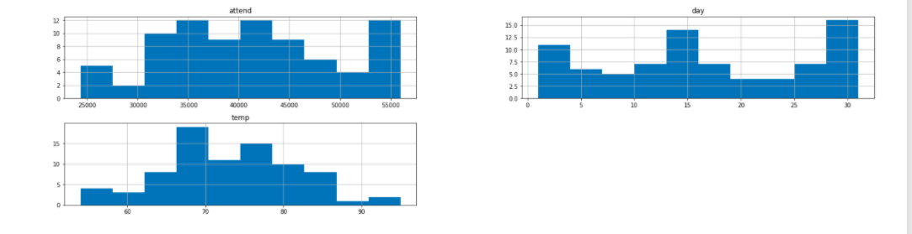
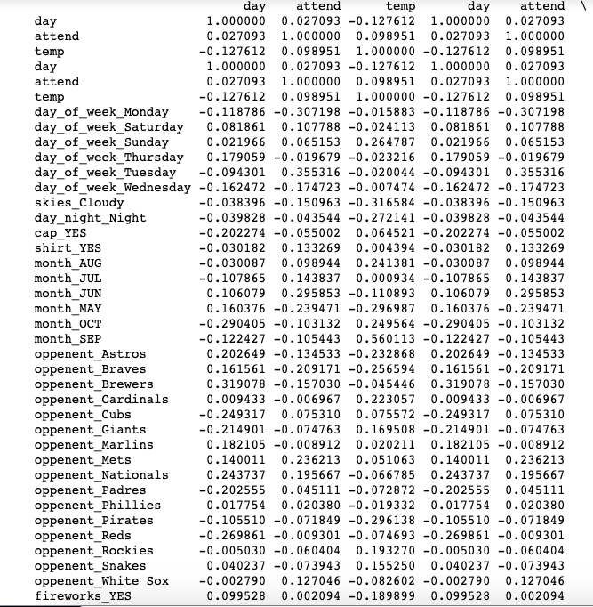

<!DOCTYPE html>

<html>
<body>

<h1>

Use Python to help determined the best  attendance promotion opportunity based on temperature, day of week, night of play, team playing, etc..

</h1>

  
      Data is from Dodgers Major League Baseball from 2012.
      The data file is  dodgers.sqlite3 database file. 
      Create plots and linear regression model to help in determining attendance turnout. 
    
    

    <lu> <h3>Required Python Packages</h3>
        <li>import sqlite3</li>
        <li>import pandas as pd</li>
        <li>import matplotlib.pyplot as plt</li>
        <li>import statsmodels.api as sm</li>
        <li>from pandas.plotting import scatter_matrix</li>
        <li>import numpy as np</li>

        </lu>

    <h3> Bar chart of attendance , temperature, day of week </h3>
    
    <h3> Days of the week by attendance </h3>
    
    
    <h3>Print out of the correlation of all the variables </h3>
    

 

<input  style="width:160;height:30; background-color:aqua"  type="button" onclick="location.href='https:/clarkec77.github.io';" value="Go  Back To HomePage" />

</body>
</html>

