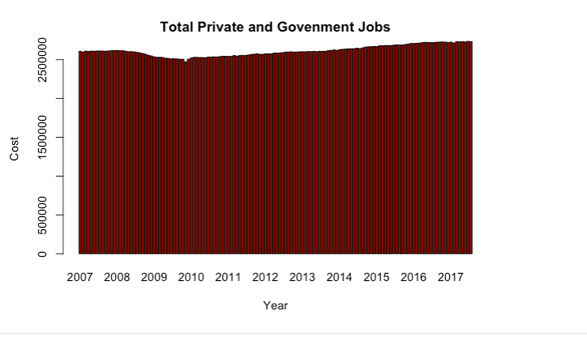

<!DOCTYPE html>
<html>
<body>

    
   
    
    <lu> <h3>Required R Packages</h3>
        <li> library(plotly)</li>
        <li>library(ggplot2)</li> 
        </lu>

Datasource ---> file bls-jobs-by-industry-category-1.csv 

<h3>Total Goverment and Private Sector jobs </h3>
<h4> Bar chart shows the growth and decline of jobs  </h4>

<h4> Histogram Chart</h4>

<h4>Line Chart with a regresssion line </h4>

   
 

<input  style="width:160;height:124; background-color:aqua"  type="button" onclick="location.href='https:/clarkec77.github.io';" value="Go  Back To HomePage" />

</body>
</html>