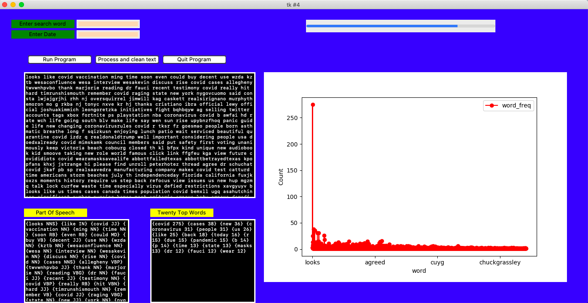

# Natural Language Processing

Create a Python project to use various Python libraries to process unstructured text from APIs.  The goal is to create sentiment analysis of the text information and determined if the text information is negative or positive. 

 Programming Lanuage

 
 <ul>
  <li>Python</li>
  
 </ul>
   

<H1> Data Cleaning</H1>

Processing of text data 

  <ol>
 
  <LI>remove stop word</li>
  <LI>lowercase all text</li>
  <LI>remove stop words</li>
  <LI>remove special characters</li>
  <LI>remove punctuation</li>
  <LI>remove common words</li>
   <LI>remove rare words</li>
   </ol> 

<H1>   NLP Analysis </H1>

 <ol> 
 <li>Word Frequency: number of words 
 <li>Word Length: average length of individual words in a text
 <li>Lexical Diversity: number of unique words used 
 <li>Lexical Density:  number of unique words divided by the total number of words

</ol>

 

<H1><a href="https:/clarkec77.github.io">Return Home</a></H1>

  

